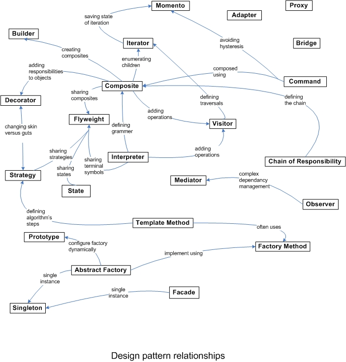

# Notes
- Refactoring and "Bad Smells in Code" [MF99] [JK05]. Code smells are certain structures in the code that "smell bad" and indicate problems that can be solved by a refactoring.
The most common code smells are: 
    - complicated code (including complicated/growing conditional code), 
    - duplicated code, 
    - inflexible code (that must be changed whenever requirements change), and 
    - unclear code (that doesn't clearly communicate its intent).

# Design Patterns
23 software design patterns

- ### Creational Patterns
    - **Factory Method**: Define an interface for creating an object, but let subclasses decide which class to instantiate
    

    - **Abstract Factory**: Provide an interface for creating families or dependent objects without specifying their concrete classes.
    

- ### Structural Patterns
- ### Behavioral Patterns

# Tools
- ### Class Diagram: https://www.visual-paradigm.com/solution/freeumltool/
